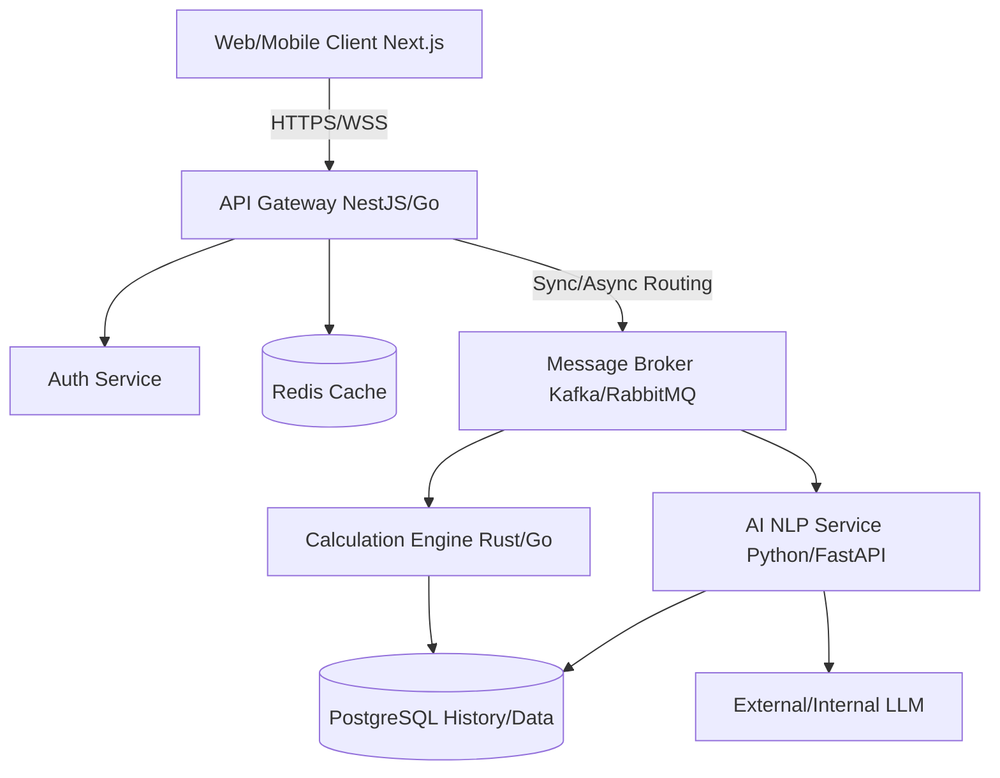

# Product Requirements Document (PRD)
**Project Name:** AI-Powered, Multi-Threaded, Highly-Scalable Calculator  
**Document Version:** 1.0  
**Date:** September 2026  

## 1. Executive Summary
The **AI-Powered Multi-Threaded Highly-Scalable Calculator** is an enterprise-grade computational platform designed to process complex mathematical expressions, matrix operations, and natural language problem descriptions. By leveraging a microservices architecture, it ensures high availability, horizontal scalability, and blazingly fast execution times through parallel processing and AI-assisted reasoning.

## 2. Product Vision & Objective
To bridge the gap between simple calculator apps and heavyweight computational software (like MATLAB or Mathematica) by providing a highly accessible, web-based, AI-driven calculator that can instantly scale to handle massive concurrent computational workloads.

## 3. Target Audience
- **Data Scientists & Engineers:** Needing quick matrix operations, statistical computations, and complex algorithmic evaluations.
- **Students & Academics:** Requiring step-by-step AI explanations for calculus, algebra, and physics problems.
- **Enterprise Systems (via API):** B2B clients needing a scalable backend to offload heavy mathematical computations.

## 4. Proposed Technology Stack
To achieve industry-standard performance and scalability, the following stack is recommended:

### Frontend (Client-Facing)
- **Framework:** Next.js (React) with TypeScript
- **Styling:** Tailwind CSS & Framer Motion (for smooth micro-animations)
- **State Management:** Zustand
- **Deployment:** Vercel or AWS Amplify

### Backend (Microservices Architecture)
- **API Gateway / Auth Service:** Node.js (NestJS) or Go - handles routing, rate limiting, and JWT authentication.
- **Calculation Engine Service:** Rust or Go - handles raw, multi-threaded CPU-intensive mathematical evaluations.
- **AI/NLP Service:** Python (FastAPI) - interfaces with LLMs (e.g., OpenAI API or local models) to parse natural language math problems into computable ASTs (Abstract Syntax Trees) and generate explanations.
- **Message Broker:** Apache Kafka or RabbitMQ - for queuing long-running asynchronous computational tasks.

### Data & Infrastructure
- **Primary Database:** PostgreSQL (Stores user profiles, computation history, and saved formulas).
- **Caching Layer:** Redis (Caches frequent AI responses and common computations).
- **Orchestration:** Docker & Kubernetes (K8s) for auto-scaling microservices based on CPU/RAM load.

## 5. Key Features & Requirements

### 5.1. Core Computational Engine
- **Multi-threading:** Capable of splitting large matrix multiplications or numerical integrations across multiple threads.
- **Precision:** Arbitrary-precision arithmetic support for high-stakes calculations.
- **Functions:** Standard arithmetic, trigonometry, calculus (derivatives/integrals), linear algebra (matrices/vectors), and statistics.

### 5.2. AI-Powered Natural Language Processing
- **Natural Language Input:** Users can type questions like *"What is the derivative of x^2 * sin(x) with respect to x?"*
- **Step-by-step Explanations:** The AI breaks down complex problems into understandable steps, not just providing the final answer.
- **Formula Suggestion:** AI predicts the formula a user is trying to write based on context.

### 5.3. Scalability & Asynchronous Processing
- **Async Queue:** For computations taking longer than 2 seconds, the system returns a job ID and streams the result back via WebSockets or Server-Sent Events (SSE).
- **Auto-scaling:** The calculation microservice scales out horizontally during traffic spikes (e.g., during final exam weeks).

### 5.4. User Management & History
- **Authentication:** OAuth2 (Google, GitHub) and email/password.
- **History & Export:** Users can view past calculations, tag them, and export them as PDF or LaTeX.

## 6. System Architecture Diagram

## 7. Non-Functional Requirements (NFRs)
- **Performance:** 95% of standard synchronous requests must resolve in < 100ms.
- **Scalability:** The system must support 10,000+ concurrent users without degradation in basic calculator functionality.
- **Availability:** 99.9% uptime SLA, achieved through Kubernetes multi-zone deployments.
- **Security:** All user data must be encrypted at rest (AES-256) and in transit (TLS 1.3). Rate limiting must be implemented to prevent DDoS and API abuse.

## 8. Development Roadmap

### Phase 1: MVP (Months 1-2)
- Set up Next.js frontend with basic UI.
- Implement the Gateway and a single Calculation Engine (supporting basic and scientific operations).
- Setup PostgreSQL for basic user history.

### Phase 2: AI Integration & Multi-threading (Months 3-4)
- Deploy Python FastAPI service and integrate with an LLM.
- Upgrade Calculation Engine to support multi-threaded matrix operations and large-scale data crunching.
- Implement Redis caching for AI responses.

### Phase 3: Scale & Enterprise Features (Months 5-6)
- Containerize and deploy to Kubernetes.
- Implement Kafka for queuing asynchronous, heavy-duty computations.
- Expose public APIs for enterprise B2B customers.
